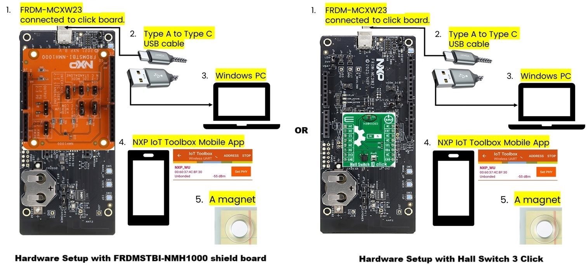

# NXP Application Code Hub

## Low power wireless sensors examples for MCXW23

- These examples demonstrate the ease of energy-efficient low-power wireless sensing applications development with FRDM-MCXW23 and low-power sensors expansion boards. It uses on-board FXLS8974CF 3-axis accelerometer, NMH1000 magnetic switch and MPL3115 pressure/altimeter sensor to demonstrate low-power wireless sensing application development with MCXW23x and transmit ALERT to connected end user via BLE wireless UART. 

- See below for more details on the MCXW23 MCU and low-power sensors used in these examples:  

- [MCX W23](https://www.nxp.com/products/MCX-W23) Ultra-Low Power Bluetooth® Low Energy MCU to provide connectivity solutions for healthcare, industrial IoT applications. The MCX W23 device constitute a highly integrated, single chip, ultra-low-power Bluetooth® Low Energy 5.3 wireless transceiver with embedded microcontroller and flash.  

- [FXLS8974CF](https://www.nxp.com/part/FXLS8974CF) is 3-axis accelerometer targeted for application requiring low-power motion wake up. This sensor has SDCD embedded block which implements an efficient and flexible inertial event detection function to detect various inertial events like no-motion/motion detecting tamper/theft/abuse on an asset. This ultra-low power wake-up on motion can trigger host MCU to wake-up or go back to deep sleep mode when no motion detected autonomously.  

- [NMH1000](https://www.nxp.com/products/sensors/magnetic-sensors/nmh1000-ultra-low-power-and-low-voltage-magnetic-switch:NMH1000) is an ultra-low power monolithic Hall effect magnetic field sensor that triggers an output when surrounding magnetic field is greater than the user-defined detection threshold. It can find lots of applications requiring change in magnetic field strength to wake-up and raise interrupt to wake-up host MCU/System.  

- [MPL3115A2S](https://www.nxp.com/products/MPL3115A2) is an compact piezoresistive absolute pressure sensor that can detect change in pressure when is greater than the user-defined detection threshold. It can find lots of applications requiring change in magnetic field strength to wake-up and raise interrupt to wake-up host MCU/System.  

- Pairing low-power MEMS sensors with MCXW23 add seamless wireless intelligence with extended battery life. Target applications include:
  - Personal Healthcare
  - Portable Medical Devices
  - Asset Tracking
  - Smart Home Appliances
  - Home security, access control
  - Battery-operated connected sensing nodes etc.  

- These example demonstrates ease-of-enablement using NXP's FRDM-MCXW23 and sensors development ecosystem to accelerate prototyping for your multiple such applications.  
 

- Note: These wireless sensors examples for NMH1000 and MPL3115 sensors work with NXP sensor shield boards (e.g. NXP FRDMSTBI-NMH1000 and NXP FRDMSTBC-P3115) as well as with MikroE click boards (e.g. MikroE Hall Switch 3 click and MikroE Accel&Pressure click). User can choose to use either NXP sensor shield board or MikroE click board and these examples will run seamlessly. For more details on these sensor expansion boards, refer to section 2.

> ##### Boards: FRDM-MCXW23
> ##### Accessories: On-Board Accelerometer FXLS8974CF, nxp_frdm_stbi_nmh1000, nxp_frdmstbc_p3115, mikroe_hall_switch_3_click, mikroe_accel_pressure_click
> ##### Categories: Sensor, Wireless Connectivity, Tools
> ##### Peripherals: I2C, UART, SENSOR
> ##### Toolchains: MCUXpresso IDE, VS Code

## Table of Contents
1. [Software](#step1)
2. [Hardware](#step2)
3. [Setup](#step3)  
3.1 [Hardware Setup](#step3.1)  
3.2 [Software Setup](#step3.2)  
4. [Run Demos](#step4)  
4.1 [Run Demo 1](#step4.1)  
4.2 [Run Demo 2](#step4.2)  
4.2 [Run Demo 3](#step4.3)
5. [Support](#step5)

## 1. Software
- IoT Sensing SDK (ISSDK) v1.8 offered as middleware in MCUXpresso SDK for supported platforms
- MCUXpresso SDK v25.06.00 for FRDM-MCXW23 or newer
- VS Code v1.100.1
- NXP IoT ToolBox mobile app providing user-friendly way to test the BLE demo applications.

## 2. Hardware
- [FRDM-MCXW23](https://www.nxp.com/design/design-center/development-boards-and-designs/FRDM-MCXW23) MCU board with on-board FXLS8974CF accelerometer
- [FRDMSTBI-NMH1000](https://www.nxp.com/part/FRDMSTBI-NMH1000) expansion shield board from NXP for NMH1000 magnetic switch sensor.
- [FRDMSTBC-P3115](https://www.nxp.com/part/FRDMSTBC-P3115) expansion shield board from NXP for MPL3115 absolute pressure sensor.
- [Hall Switch 3 click](https://www.mikroe.com/hall-switch-3-click) expansion click board from MikroE for NMH1000 magnetic switch sensor.
- [Accel & Pressure click](https://www.mikroe.com/accelpressure-click) expansion click board from MikroE for MPL3115 absolute pressure.sensor.
- Personal Computer
- Mini/micro C USB cable
- Android or Apple Mobile Phone supprting BLE wireless connectivity.

## 3. Setup

### 3.1 Step 1
### 3.1 Hardware Setup

#### 3.1.1 Step 1: Connect Hardware
- Know about the Hardware Boards that you will need:  
 
- For running MCXW23 based FXLS8974CF motion wakeup example, the HW setup is shown below:  
 
- For running MCXW23 based NMH1000 magnetic wakeup example, the HW setup is show below:  
 
- For running MCXW23 based MPL3115 pressure wakeup example, the HW setup is show below:  
 
- For FRDMSTBC-P3115 board, perform following HW settings:  
- Connect J7 and J8 pins 1-2 on FRDM-STBC-P3115 shield board.  
 
- Connect a micro USB cable from connector MCU-LINK to a host computer. 
- Personal Computer
- Mini/micro C USB cable
- Android or Apple Mobile Phone supprting BLE wireless connectivity.

### 3.2 Software Setup

#### 3.2.1 Step 1: Download and Install required Software(s)
- Download and Install [VS Code IDE v1.100.1 or newer](https://code.visualstudio.com/download)
- Download and Install [MCUXpresso Installer for VS Code](https://github.com/nxp-mcuxpresso/vscode-for-mcux/wiki/Dependency-Installation)
- Follow the [Getting started with MCUXpresso for VS code](https://www.nxp.com/design/design-center/training/TIP-GETTING-STARTED-WITH-MCUXPRESSO-FOR-VS-CODE)
- Download and Install MCUXpresso SDK v25.06.00 for FRDM-MCXW23 or newer
- Install [NXP IoT ToolBox App - Android Store](https://play.google.com/store/apps/details?id=com.freescale.kinetisbletoolbox&hl=en_US&pli=1) or
  [NXP IoT ToolBox App - Apple Store](https://apps.apple.com/us/app/iot-toolbox/id1362450908)

#### 3.2.2 Step 2: Get example projects from Application Code Hub (ACH) Github
- Open VS Code and select "Clone Git Repository" option.  
 
- VS Code will open a pop-up to allow you to enter the Git repository URL.  
 
- Copy the ACH gihub URL:"https://github.com/nxp-appcodehub/dm-low-power-wireless-sensors-examples-for-mcxw23.git" and select the the "Clone from URL" option.  
 
- It will ask for local destination directory where you would like to save the cloned repository, create a "git" folder under C: drive and select that folder.  
 
- VS Code will start cloning the repository into the destination folder.
- Click on "Import Project(s)" to start importing the chosen ACH project(s).  
 
- Select the cloned repository destination folder i.e. "C:/git/dm-low-power-wireless-sensors-examples-for-mcxw23".  
 
- Import Demo#1 "frmdmcxw23_fxls8974cf_motion_wakeup_ble" project into VS code workspace:  
 
- Select the toolchain version: ARM GNU Toolchain.
- The selected "frmdmcxw23_fxls8974cf_motion_wakeup_ble" project is now imported on the VS Code workspace.
- Import Demo#2 "frmdmcxw23_nmh1000_mag_wakeup_ble" project into VS code workspace:  
 
- Select the toolchain version: ARM GNU Toolchain.
- The selected "frmdmcxw23_nmh1000_mag_wakeup_ble" project is now imported on the VS Code workspace.
- Import Demo#3 "frmdmcxw23_mpl3115_pressure_wakeup_ble" project into VS code workspace:  
 
- Select the toolchain version: ARM GNU Toolchain.
- The selected "frmdmcxw23_mpl3115_pressure_wakeup_ble" project is now imported on the VS Code workspace.

#### 3.2.3 Step 3: Build example projects
- Select example project that you want to build and run.
- Connect the appropriate sensor shield board (Refer to [section 3.1.1](#3.1.1)):
  - If you want to run FXLS8974CF examples then you dont need to connect any sensor shield board to FRDM-MCXW23.
  - If you want to run NMH1000 based example then connect FRDMSTBI-NMH1000 or Hall Switch 3 click board to FRDM-MCXW23.
  - If you want to run MPL3115 based examples then connect FRDMSTBC-P3115 or Accel&Pressure click board to to FRDM-MCXW23.
- Right click on chosen project and select "Prestine Build/Rebuild Project" to start clean build the project.

## 4 Run Demos

### 4.1 Run Demo 1: Low-Power Motion Wakeup with FXLS8974CF using BLE Wireless UART
#### 4.1.1 Step 1: Flash the demo firmware on FRDM-MCXW23 board
- Connect a USB-C cable between the host PC and the MCU-Link USB port on the target FRDM-MCXW23 board.
- Choose the "frmdmcxw23_fxls8974cf_motion_wakeup_ble" project.
- Right click on the project and select "Debug".
- Debugger will start downloading the program to device.
- Click on “Continue” button or press "F5" from your keyboard to resume running the downloaded program on device.
- Click on “Terminate” button to terminate the debug session.
- Disconnect the USB-C cable connected to FRDM-MCXW23 and reconnect.

#### 4.1.2 Step 2: Start Advertising
- After that you should see white/bluish LED blinking and when you open a serial terminal (with baudrate 115200). You will see W UART starting as GAP central.
- On the FRDM-MCXW23 board, press SW5 followed by SW2, then you will see the profile shift to GAP Peripheral and now advertising.  
 

#### 4.1.3 Step 3: Connect to the IoT ToolBox App
- Open the installed NXP IoT Toolbox (available from Play Store and App Store) on your mobile phone. Make sure bluetooth connection is ON.
- Inside the application, click on the Wireless UART widget. Scan should start automatically.  
  
- When a device called NXP_WU appears, click on it. Your phone should now be connecting to the board.  
  

#### 4.1.4 Step 4: Run the FXLS8974CF motion wakeup Demo
- When you show tampering/movement on the FRDM-MCXW23, the on-board FXLS8974CF accelerometer detects the motion and wakes-up.
- At that point, you will see Wireless UART app showing ALERT message as shown below:  
  
- FRDM-MCXW23 board will also show "RED" LED status. The "RED" LED status will continously remain ON till tampering/motion detected.
- If there is no further tampering/motion detected for continous ~5 sec, the on-board FXLS8974CF accelerometer will detect no-motion and update the status message
  "Your Asset is Safe" on wirless UART app. The "RED" LED status on FRDM-MCXW23 board will also go OFF.
  
### 4.2 Run Demo 2: Low-Power Magnetic Wakeup with NMH1000 using BLE Wireless UART
#### 4.2.1 Step 1: Flash the demo firmware on FRDM-MCXW23 board
- Connect a USB-C cable between the host PC and the MCU-Link USB port on the target FRDM-MCXW23 board.
- Choose the "frmdmcxw23_nmh1000_mag_wakeup_ble" project.
- Right click on the project and select "Debug".
- Debugger will start downloading the program to device.
- Click on “Continue” button or press "F5" from your keyboard to resume running the downloaded program on device.
- Click on “Terminate” button to terminate the debug session.
- Disconnect the USB-C cable connected to FRDM-MCXW23 and reconnect.

#### 4.2.2 Step 2: Start Advertising
- After that you should see white/bluish LED blinking and when you open a serial terminal (with baudrate 115200). You will see W UART starting as GAP central.
- On the FRDM-MCXW23 board, press SW5 followed by SW2, then you will see the profile shift to GAP Peripheral and now advertising.  
 

#### 4.2.3 Step 3: Connect to the IoT ToolBox App
- Open the installed NXP IoT Toolbox (available from Play Store and App Store) on your mobile phone. Make sure bluetooth connection is ON.
- Inside the application, click on the Wireless UART widget. Scan should start automatically.  
  
- When a device called NXP_WU appears, click on it. Your phone should now be connecting to the board.  
  

#### 4.2.4 Step 4: Run the NMH1000 mag wakeup Demo
- When you put a magnet near to the NMH1000 sensor to show tampering on the FRDM-MCXW23, NMH1000 detects change in magnetic field and wakes-up.
- At that point, you will see Wireless UART app showing ALERT message as shown below:  
  
- FRDM-MCXW23 board will also show "RED" LED status. The "RED" LED status will continously remain ON till tampering/magnetic field change detected.

### 4.3 Run Demo 3: Low-Power Pressure Wakeup with MPL3115 using BLE Wireless UART
#### 4.3.1 Step 1: Flash the demo firmware on FRDM-MCXW23 board
- Connect a USB-C cable between the host PC and the MCU-Link USB port on the target FRDM-MCXW23 board.
- Choose the "frmdmcxw23_mpl3115_pressure_wakeup_ble" project.
- Right click on the project and select "Debug".
- Debugger will start downloading the program to device.
- Click on “Continue” button or press "F5" from your keyboard to resume running the downloaded program on device.
- Click on “Terminate” button to terminate the debug session.
- Disconnect the USB-C cable connected to FRDM-MCXW23 and reconnect.

#### 4.3.2 Step 2: Start Advertising
- After that you should see white/bluish LED blinking and when you open a serial terminal (with baudrate 115200). You will see W UART starting as GAP central.
- On the FRDM-MCXW23 board, press SW5 followed by SW2, then you will see the profile shift to GAP Peripheral and now advertising.  
 

#### 4.3.3 Step 3: Connect to the IoT ToolBox App
- Open the installed NXP IoT Toolbox (available from Play Store and App Store) on your mobile phone. Make sure bluetooth connection is ON.
- Inside the application, click on the Wireless UART widget. Scan should start automatically.  
  
- When a device called NXP_WU appears, click on it. Your phone should now be connecting to the board.  
  

#### 4.3.4 Step 4: Run the MPL3115 pressure wakeup Demo
- When you press/apply pressure (keep pressing) with your index finger to the MPL3115 sensor to show tampering on the FRDM-MCXW23, MPL3115 sensor detects change in pressure and wakes-up.
- At that point, you will see Wireless UART app showing ALERT message as shown below:  
  
- FRDM-MCXW23 board will also show "RED" LED status. The "RED" LED status will continously remain ON for few seconds to show alert.
- After "RED" LED goes OFF, the Wireless UART app will show message "Your Asset is Safe".
- Then you can try applying pressure on MPL3115 sensor again.

#### Congratulations! You have successfully executed all the 3 demos. Now think of various applications where you can use these demos.

## 5. Support
- Reach out to NXP Sensors Community page for more support - [NXP Community](https://community.nxp.com/t5/forums/postpage/choose-node/true?_gl=1*fxvsn4*_ga*MTg2MDYwNjMzMy4xNzAyNDE4NzM0*_ga_WM5LE0KMSH*MTcwMjQxODczMy4xLjEuMTcwMjQxODczNi4wLjAuMA..)
- For more details on FXLS8974CF SDCD block, refer to the application note - [AN12004](https://www.nxp.com/docs/en/application-note/AN12004.pdf)
- Learn more about FXLS8974CF 3-axis accelerometer, refer to - [FXLS8974CF DS](https://www.nxp.com/docs/en/data-sheet/FXLS8974CF.pdf)
- Learn more about MPL3115 absolute pressure sensor, refer to - [MPL3115 DS](https://www.nxp.com/docs/en/data-sheet/MPL3115A2S.pdf)
- Learn more about NMH1000 magnetic switch sensor, refer to - [NMH1000 DS](https://www.nxp.com/docs/en/data-sheet/NMH1000.pdf)

- Accelerate your sensors development using Sensor ToolBox, refer to - [Sensors Development Ecosystem](https://www.nxp.com/design/design-center/software/sensor-toolbox:SENSOR-TOOLBOXX)

#### Project Metadata

<!----- Boards ----->

<!----- Accessories ----->

<!----- Categories ----->

<!----- Peripherals ----->

<!----- Toolchains ----->

Questions regarding the content/correctness of this example can be entered as Issues within this GitHub repository.

>**Warning**: For more general technical questions regarding NXP Microcontrollers and the difference in expected functionality, enter your questions on the [NXP Community Forum](https://community.nxp.com/)

## 7. Release Notes
| Version | Description / Update                           | Date                        |
|:-------:|------------------------------------------------|----------------------------:|
| 1.0     | Initial release on Application Code Hub        | July 31st 2025 |

<small>
<b>Trademarks and Service Marks</b>: There are a number of proprietary logos, service marks, trademarks, slogans and product designations ("Marks") found on this Site. By making the Marks available on this Site, NXP is not granting you a license to use them in any fashion. Access to this Site does not confer upon you any license to the Marks under any of NXP or any third party's intellectual property rights. While NXP encourages others to link to our URL, no NXP trademark or service mark may be used as a hyperlink without NXP’s prior written permission. The following Marks are the property of NXP. This list is not comprehensive; the absence of a Mark from the list does not constitute a waiver of intellectual property rights established by NXP in a Mark.
</small>
 
<small>
NXP, the NXP logo, NXP SECURE CONNECTIONS FOR A SMARTER WORLD, Airfast, Altivec, ByLink, CodeWarrior, ColdFire, ColdFire+, CoolFlux, CoolFlux DSP, DESFire, EdgeLock, EdgeScale, EdgeVerse, elQ, Embrace, Freescale, GreenChip, HITAG, ICODE and I-CODE, Immersiv3D, I2C-bus logo , JCOP, Kinetis, Layerscape, MagniV, Mantis, MCCI, MIFARE, MIFARE Classic, MIFARE FleX, MIFARE4Mobile, MIFARE Plus, MIFARE Ultralight, MiGLO, MOBILEGT, NTAG, PEG, Plus X, POR, PowerQUICC, Processor Expert, QorIQ, QorIQ Qonverge, RoadLink wordmark and logo, SafeAssure, SafeAssure logo , SmartLX, SmartMX, StarCore, Symphony, Tower, TriMedia, Trimension, UCODE, VortiQa, Vybrid are trademarks of NXP B.V. All other product or service names are the property of their respective owners. © 2021 NXP B.V.
</small>

